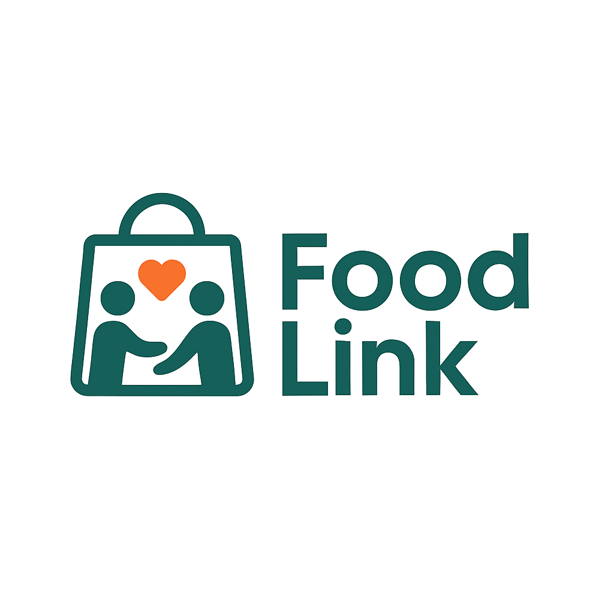

  

# FoodLink

**Less food waste. More community support.**

A full-stack portfolio project connecting food donors, charities and the people they serve.

React · TypeScript · Node.js · PostgreSQL · Docker

## The idea

Good food should reach people who need it. FoodLink explores how a shared platform can make donating, distributing and collecting surplus food easier—from a donor's first offer to a community collection event.

## Project focus

- **Donors:** offer surplus food and follow their donations.
- **Recipients:** discover food support and arrange collections.
- **Charity teams:** coordinate inventory, volunteers and distribution events.
- **Buyers:** discover surplus food made available for purchase.

The project brings together role-based interfaces, relational data modelling, API design and containerized application development around a practical social purpose.

## Built with

| Layer                | Technology                            |
| -------------------- | ------------------------------------- |
| Frontend             | React, TypeScript, Vite, Tailwind CSS |
| Backend              | Node.js, Express, TypeScript          |
| Database             | PostgreSQL                            |
| Image storage        | S3-compatible storage / MinIO         |
| Local infrastructure | Docker Compose                        |

Explore the [frontend](frontend), [backend](backend) and [database](db).

## What's next

FoodLink is an evolving prototype. The next development phase focuses on multiple charities and locations, scoped manager permissions, donation requests, spreadsheet imports, household allowances and flexible distribution events with controlled surplus sales.

**Development status:** The current branch includes unfinished multi-charity integration and does not yet pass the backend build. See the [development status](docs/DEVELOPMENT_STATUS.md) for the current checkpoint and remaining work.

---

Built by [Constantin Gruhl](https://github.com/ConstantinGruhl) as part of my software development portfolio.
