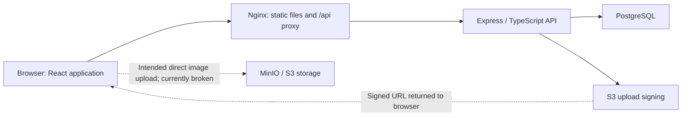

# FoodLink: current state and development plan

> Historical baseline assessment. The subsequent Docker implementation and its verification results are recorded in [IMPLEMENTATION_SUMMARY.md](IMPLEMENTATION_SUMMARY.md). Defects below describe the original project before that work.

Assessment date: **9 September 2026, Europe/Berlin**. Baseline commit: **f0951eef**.

**Assessment: FoodLink is a runnable demonstration with real persistence, but it is not yet a reliable operational prototype or ready for public production use.** The existing stack and much of the interface can be retained. The main work is completing and securing the workflows, correcting data handling, and establishing dependable delivery and operations.

This assessment covers all first-party frontend/backend source, the database schema, container configuration, dependency manifests, repository practices, desktop and phone-width browser inspection, API checks, and temporary database write tests. Runtime evidence was collected locally. The API/write evidence timestamp uses UTC and therefore shows 8 September late evening; browser evidence uses the Berlin assessment date.

## 1. What was done in this assessment

The application was built and started using the supplied Docker Compose setup. The original frontend build failed with `tsc: not found`: its `COPY . .` step copied the repository's host `node_modules` over dependencies installed inside Linux.

Added [frontend/.dockerignore](C:/Users/gruhl/OneDrive/Dokumente/ConstantinsWorkspace/Foodlink/FoodLink/frontend/.dockerignore) to exclude dependencies, generated builds, TypeScript build metadata, and Git metadata. The next build succeeded. This is the only application setup change made; feature defects described below remain for the development phase.

The following are running:

| Component | Local address or service | Result |
|---|---|---|
| Frontend / Nginx | [FoodLink](http://localhost:5173) | Production frontend build served successfully |
| Express API | [Health through frontend proxy](http://localhost:5173/api/health) | HTTP 200 |
| PostgreSQL 16 | Compose `db` service, host port 5432 | Healthy; initialized schema and demo seed |
| MinIO | Ports 9000 and 9001 | Process running; upload provisioning incomplete |

The database started with five demo users, four items, one event, and no donations or orders. Temporary API tests created a donation and orders, checked their database effects, and removed only those test records. Final counts matched the initial counts. No real payments, emails, or external deployments were performed.

The frontend TypeScript/Vite production build passed, and the backend TypeScript check passed independently. The main frontend JavaScript bundle is approximately **1,098 kB**, or **338 kB gzipped**; the logo asset is another **552 kB**. Successful compilation did not detect the runtime contract problems below.

[Startup instructions](C:/Users/gruhl/OneDrive/Dokumente/ConstantinsWorkspace/Foodlink/FoodLink/README.md), [API/write evidence](C:/Users/gruhl/OneDrive/Dokumente/ConstantinsWorkspace/Foodlink/FoodLink/docs/evidence/runtime-checks.json), [browser/build evidence](C:/Users/gruhl/OneDrive/Dokumente/ConstantinsWorkspace/Foodlink/FoodLink/docs/evidence/browser-build-checks.json).

## 2. Existing product and architecture

FoodLink aims to coordinate food rescue across five roles: donors offer food, recipients reserve it, buyers purchase surplus, volunteers run distributions, and administrators manage the platform. Public pages communicate mission and impact.

The architecture is straightforward:

| Layer | Existing implementation | Assessment |
|---|---|---|
| Frontend | React 18, TypeScript, Vite, React Router, Tailwind, Zustand, Axios | Suitable foundation; shared data contracts and error handling need work |
| UI utilities | Reusable cards/forms, image gallery, QR, charts, PDF generation | Useful components; some are demonstrations or lack complete workflows |
| Backend | Express 4, TypeScript, parameterized SQL using `pg` | Small enough to consolidate without a rewrite |
| Database | Users, items, images, donations, events, orders and impact | Core entities exist; important operational history and constraints are missing |
| Storage | S3-compatible signing and image metadata | Incomplete configuration and ownership/validation controls |
| Delivery | Multi-stage Docker builds, Nginx proxy, persistent volumes | Local foundation exists; no production release process |

Positive foundations include foreign keys, several database constraints, parameterized queries, donor history mapping, and a correctly implemented transaction for donation creation. There is no need to introduce microservices to address the current gaps.

## 3. Feature inventory: what is present and what works

“Partial” means meaningful implementation exists but the complete user outcome is not reliable.

| Feature | State | Evidence / missing behavior |
|---|---|---|
| Home and marketing pages | Present | Render in browser; inconsistent FoodShare/FoodLink branding, fixed impact figures and unimplemented feature claims |
| Role login | Demo works | All five seeded roles have email-only login; no identity verification |
| Registration | Broken | Form exists; `POST /auth/register` returns 404; form does not await response |
| Recipient catalog and request screen | Broken UI / partial API | Cold authenticated visit crashes before event loads; isolated API reservation works |
| Pickup ticket / QR | Partial | QR component exists, but order-history endpoint is absent; no scan/redemption workflow |
| Buyer marketplace | Broken UI / partial API | API returns seeded yogurt; UI filters it out due to field-name mismatch |
| Buyer checkout | Demo API only | Creates a confirmed database order; no actual payment or notification |
| Donor submission and history | Partial, strongest flow | Form renders; API creates multi-item donations and history reads them successfully |
| Donation cancellation / receipt status | Missing API | UI controls exist; status update returns 404 |
| Image upload / gallery | Partial and blocked | Presigner responds, but returns Docker-internal hostname; bucket absent; upload errors/cache mishandled |
| Volunteer operations | Partial screen | Event loads; other operational data is not independently loaded; event creation/status APIs absent |
| Administration | Stub | Users/roles and CMS cards are placeholders; no usable administration workflow |
| Public impact | Broken / demo data | API responds; impact page crashes on undefined fields; charts use constants |
| PDF certificates / reports | Partial | Client generation exists; data and receipt status do not establish accurate operational reports |
| Notifications, tasks and delivery | Missing | No email/SMS dispatch, task assignment, delivery scheduling or completion |
| Mobile and accessibility | Partial | Responsive content exists; primary navigation disappears at phone width, no replacement menu |

No complete donor → received stock → reservation → confirmed collection → accurate impact journey can currently be completed through the application.

## 4. Highest-priority findings

**P0** means a blocker before sharing with real users or relying on stock/order correctness. **P1** means necessary for a dependable prototype. **P2** means necessary hardening or a subsequent scoped capability. Priorities indicate consequence, not implementation size.

### P0 — Authentication and authorization are absent

Login is a database lookup by email. Knowing the seeded admin email is sufficient to obtain the admin user object. The response returns the full user row, including any stored household, dietary, special-requirement, address and NGO-code fields, so knowing an existing email also exposes that profile. API writes trust supplied user or donor IDs, and there are no server-side role, ownership, or recipient-verification checks. The frontend stores the user object and role in localStorage; that is not an authenticated session.

**Next step:** implement real identity verification and server-managed sessions or validated tokens, then enforce permissions and ownership on every protected route. Derive the acting user from the session, not the request body. Define who can approve recipients, receive donations, create events and redeem pickups. Add account lifecycle, session expiry/logout, and recovery.

Evidence: [demo login and order routes](C:/Users/gruhl/OneDrive/Dokumente/ConstantinsWorkspace/Foodlink/FoodLink/backend/src/routes.ts:32), [router registration](C:/Users/gruhl/OneDrive/Dokumente/ConstantinsWorkspace/Foodlink/FoodLink/backend/src/server.ts:14), [client authentication store](C:/Users/gruhl/OneDrive/Dokumente/ConstantinsWorkspace/Foodlink/FoodLink/frontend/src/store/useAuth.ts:33).

### P0 — Stock transactions are not safe under concurrency or failure

Reservation and checkout issue `BEGIN`, row locks, updates and `COMMIT` via separate `pool.query` calls. A transaction must stay on one checked-out connection. The sequential smoke tests pass, but they do not establish correctness with concurrent requests. Exceptions also lack reliable rollback and release handling in these routes.

**Next step:** use a single client per transaction with rollback/release, validate the entire basket before committing, lock stock consistently, and add idempotency for repeat submissions. Test simultaneous attempts at the last unit, partial failure, cancellation and retry. Donation creation already demonstrates the appropriate client pattern.

Evidence: [reservation and checkout](C:/Users/gruhl/OneDrive/Dokumente/ConstantinsWorkspace/Foodlink/FoodLink/backend/src/routes.ts:46), [donation transaction](C:/Users/gruhl/OneDrive/Dokumente/ConstantinsWorkspace/Foodlink/FoodLink/backend/src/routes/donations.ts:17). The requirement to use one client is documented by [node-postgres](https://node-postgres.com/features/transactions).

### P1 — API contracts cause crashes and invisible inventory

The API returns database names such as `is_surplus`, `price_cents`, `pickup_window` and `total_meals_distributed`. The frontend expects `isSurplus`, `priceCents`, `pickupWindow` and `totalMealsDistributed`.

Browser verification reproduced a blank impact page with a `toLocaleString` error and an empty buyer marketplace despite a nonempty API response. Separately, recipient login caused a blank page because `events[0].date` is read before events arrive.

**Next step:** define explicit API response schemas, map database rows at the server boundary, remove `any[]` from critical stores, and add loading/error/empty states plus an error boundary. Enable strict frontend type checking incrementally. Tests must exercise actual responses, not merely compile interfaces.

Evidence: [API responses](C:/Users/gruhl/OneDrive/Dokumente/ConstantinsWorkspace/Foodlink/FoodLink/backend/src/routes.ts:10), [data store](C:/Users/gruhl/OneDrive/Dokumente/ConstantinsWorkspace/Foodlink/FoodLink/frontend/src/store/useData.ts:33), [impact render](C:/Users/gruhl/OneDrive/Dokumente/ConstantinsWorkspace/Foodlink/FoodLink/frontend/src/pages/PublicImpact.tsx:19), [marketplace filter](C:/Users/gruhl/OneDrive/Dokumente/ConstantinsWorkspace/Foodlink/FoodLink/frontend/src/pages/Marketplace.tsx:20), [recipient event render](C:/Users/gruhl/OneDrive/Dokumente/ConstantinsWorkspace/Foodlink/FoodLink/frontend/src/pages/RecipientDashboard.tsx:42).

### P1 — Four advertised actions have no endpoint

Runtime checks returned 404 for every route below.

| Missing endpoint | Blocked outcome |
|---|---|
| `POST /api/auth/register` | Creating an account |
| `GET /api/orders/mine` | Order history and pickup tickets |
| `PATCH /api/donations/:id` | Donation cancellation and receiving/distribution status |
| `POST /api/events` | Scheduling distributions |

Implement these with permissions, validation and defined state transitions. Volunteer and admin screens also need explicit authorized data endpoints/loaders, rather than depending on a previous user's cached state. Logout should clear user-scoped data.

Evidence: [auth request](C:/Users/gruhl/OneDrive/Dokumente/ConstantinsWorkspace/Foodlink/FoodLink/frontend/src/store/useAuth.ts:71), [missing data operations](C:/Users/gruhl/OneDrive/Dokumente/ConstantinsWorkspace/Foodlink/FoodLink/frontend/src/store/useData.ts:112), [volunteer loading](C:/Users/gruhl/OneDrive/Dokumente/ConstantinsWorkspace/Foodlink/FoodLink/frontend/src/pages/VolunteerDashboard.tsx:13).

### P1 — Success messages can be false

Registration, recipient reservation and volunteer event creation do not await their asynchronous writes. Recipient submission starts one independent order per selected item, reports confirmation immediately, and clears the selection. A synchronous `try/catch` does not catch the rejected promises.

Buyer checkout claims “Payment accepted. Confirmation sent” although neither service exists.

**Next step:** await server confirmation, submit a recipient basket as one atomic order, preserve input on failure, disable repeat submission while pending, and make status text match actual behavior. Separate a successful write from a failed subsequent refresh.

Evidence: [registration](C:/Users/gruhl/OneDrive/Dokumente/ConstantinsWorkspace/Foodlink/FoodLink/frontend/src/pages/Register.tsx:37), [reservation submission](C:/Users/gruhl/OneDrive/Dokumente/ConstantinsWorkspace/Foodlink/FoodLink/frontend/src/pages/RecipientDashboard.tsx:27), [checkout message](C:/Users/gruhl/OneDrive/Dokumente/ConstantinsWorkspace/Foodlink/FoodLink/frontend/src/pages/Marketplace.tsx:33).

### P1 — Inventory and fulfillment rules are incomplete

A scheduled donation becomes reservable immediately, before receipt. The temporary smoke test confirmed this. Reservation does not enforce the non-surplus category or recipient eligibility. Catalog/checkout queries ignore expiry, and “next event” chooses the oldest event even after it is in the past.

There is no complete cancellation/restocking, pickup confirmation, no-show, expiry, waste, or delivery process. A QR containing order ID/name has no server-side redemption or replay protection.

**Next step:** distinguish offered, received and available food; make availability depend on receipt, expiry and allocation rules; add event capacity/cutoffs; implement explicit order transitions and exactly-once collection. Decide how recipient priority and surplus release work before building those rules.

Evidence: [donation availability](C:/Users/gruhl/OneDrive/Dokumente/ConstantinsWorkspace/Foodlink/FoodLink/backend/src/routes/donations.ts:22), [catalog and events](C:/Users/gruhl/OneDrive/Dokumente/ConstantinsWorkspace/Foodlink/FoodLink/backend/src/routes.ts:16), [ticket](C:/Users/gruhl/OneDrive/Dokumente/ConstantinsWorkspace/Foodlink/FoodLink/frontend/src/pages/RecipientDashboard.tsx:87).

### P1 — Runtime input and error controls are insufficient

SQL parameters are a positive foundation, but they do not validate business inputs. Quantities, UUIDs, storage values, monetary contributions and cart lines need schemas and limits. Negative contributions can reduce totals; invalid quantities can reach stock updates before database constraints reject later writes. Active Express 4 async handlers frequently omit error forwarding.

**Next step:** validate at the API boundary, reject invalid values with consistent 4xx responses, centralize error handling, constrain money in the database, and add request IDs and redacted logs. Add rate limits for login, writes and upload signing. Malformed requests must not terminate the server or leave open transactions.

Evidence: [order handlers](C:/Users/gruhl/OneDrive/Dokumente/ConstantinsWorkspace/Foodlink/FoodLink/backend/src/routes.ts:42), [server middleware](C:/Users/gruhl/OneDrive/Dokumente/ConstantinsWorkspace/Foodlink/FoodLink/backend/src/server.ts:14).

### P1 — Uploads are not a working or controlled pipeline

The running presigner returned an upload host of `minio:9000`, which is a Docker-network hostname rather than a normal browser address. The new MinIO data directory contained no bucket, and Compose has no bucket/policy provisioning.

Two upload implementations are mounted at overlapping paths; the earlier handler wins and uses different environment names from the later one. The frontend ignores the PUT response status and caches image lists indefinitely, including empty lists.

**Next step:** consolidate routes/configuration; provision the local bucket and intended read/CORS behavior; generate URLs for an address the browser can reach; check upload completion; invalidate image caches. Require item ownership, file-size/type checks, safe metadata, and cleanup of abandoned uploads. Do not rewrite a signed hostname after signing.

Evidence: [active uploader](C:/Users/gruhl/OneDrive/Dokumente/ConstantinsWorkspace/Foodlink/FoodLink/backend/src/uploads.ts:22), [duplicate mounts](C:/Users/gruhl/OneDrive/Dokumente/ConstantinsWorkspace/Foodlink/FoodLink/backend/src/server.ts:18), [browser upload](C:/Users/gruhl/OneDrive/Dokumente/ConstantinsWorkspace/Foodlink/FoodLink/frontend/src/components/ImageUploader.tsx:15), [image cache](C:/Users/gruhl/OneDrive/Dokumente/ConstantinsWorkspace/Foodlink/FoodLink/frontend/src/store/useData.ts:93).

## 5. Data model and reporting gaps

The schema is a useful beginning, but `items.qty` currently serves several incompatible purposes. In the smoke test, a donation created with quantity three was shown in donation history as quantity two after one reservation. This loses the original donated quantity.

| Area | Required development |
|---|---|
| Donation lines | Preserve offered and received quantities independently of remaining stock |
| Inventory | Track stock movements, reservation allocation, receipt, adjustment, expiry, disposal and cancellation |
| Order lines | Store quantity plus name/unit/price snapshots so historical records remain meaningful |
| Deletion/history | Avoid cascading deletion of completed business history; define retention/archive rules |
| Events | Structured start/end times, timezone, capacity, location, status and cutoff policy |
| Food metadata | Define categories, units/weight, expiry meaning, allergens and handling fields with the operator |
| Roles/organizations | Clarify one operating organization versus multiple isolated partner organizations |
| Impact | Compute totals from completed distributions and defined weight/meal measures |
| Audit history | Record who changed eligibility, stock, orders, status and reports |

Impact currently reads a seeded row which no business operation updates. Charts and marketing metrics are fixed values. PDF donation certificates use the current date and do not require confirmed receipt; volunteer “weekly” exports do not filter a reporting period. Treat these as demo outputs until their source data and definitions are reliable.

Evidence: [schema](C:/Users/gruhl/OneDrive/Dokumente/ConstantinsWorkspace/Foodlink/FoodLink/db/init.sql:65), [donation history query](C:/Users/gruhl/OneDrive/Dokumente/ConstantinsWorkspace/Foodlink/FoodLink/backend/src/routes/users.ts:21), [static charts](C:/Users/gruhl/OneDrive/Dokumente/ConstantinsWorkspace/Foodlink/FoodLink/frontend/src/components/Charts.tsx:6), [certificate](C:/Users/gruhl/OneDrive/Dokumente/ConstantinsWorkspace/Foodlink/FoodLink/frontend/src/pages/DonorDashboard.tsx:67), [weekly export](C:/Users/gruhl/OneDrive/Dokumente/ConstantinsWorkspace/Foodlink/FoodLink/frontend/src/pages/VolunteerDashboard.tsx:27).

Introduce versioned schema migrations and a separate demo seed. The current initialization file runs automatically only for a new PostgreSQL volume; it is not an upgrade mechanism. Re-running it manually also duplicates sample inventory.

## 6. UX, product scope and trust

At 390 px width, marketing content adapts, but the main navigation disappears with no mobile menu. Several inputs lack associated labels; handled action errors mostly use browser alerts, while several asynchronous failures are unhandled. There is no catch-all route or recoverable application error screen. Privacy/terms links lead to undefined routes, and metadata refers to missing favicon/social images.

The landing page advertises reminders, donation editing/deadlines, badges, task assignment, real-time tracking, delivery and compliance that are not established by the implementation. Public numbers and testimonials should be clearly identified as demonstration content or replaced with verified material.

Prioritize mobile navigation, accessible form labels and keyboard submission, inline validation, loading/empty/error states, stock-aware quantity controls, cart edit/remove, complete history, and clear status terminology. Recipient and buyer cards should display the storage and expiry information already collected during donation entry; this is also a presentation gap, not just missing future metadata. Use one brand name and decide language, currency and operating timezone.

Before collecting real household information, define what data is necessary, who may access it, and the retention/deletion process. The intended operator and jurisdiction remain unknown; this review does not establish legal compliance or food-handling compliance.

## 7. Dependency and production readiness

Dependency audits were checked against npm advisories during this assessment:

| Audit scope | Critical | High | Moderate | Low | Total dependency entries |
|---|---:|---:|---:|---:|---:|
| Backend installed production dependencies | 1 | 2 | 21 | 1 | 25 |
| Frontend lockfile, including build tools | 1 | 15 | 4 | 2 | 22 |

These are npm dependency vulnerability entries, including transitive propagation; they are not counts of independently exploitable flaws in FoodLink. Exploitability was not assessed. The backend's critical entry is transitive `fast-xml-parser`; frontend `jspdf` is critical. Other flagged direct frontend packages include Axios, React Router, PostCSS and Vite. Do not apply blind major-version fixes: update and verify PDF, network, routing and build behavior. Full dated results and advisory URLs are in the [backend audit](C:/Users/gruhl/OneDrive/Dokumente/ConstantinsWorkspace/Foodlink/FoodLink/docs/evidence/backend-audit.json) and [frontend audit](C:/Users/gruhl/OneDrive/Dokumente/ConstantinsWorkspace/Foodlink/FoodLink/docs/evidence/frontend-audit.json).

Both Docker builds use Node 20, which is now end-of-life. Move to a supported LTS runtime, with Node 24 a reasonable current target. [Official Node release status](https://nodejs.org/en/about/previous-releases). Locked Vite 7.1.11 is outside the currently supported branches; update to a supported minor/major and validate plugin compatibility. [Vite support policy](https://vite.dev/releases).

Other delivery gaps:

- **Repository hygiene:** the original repository tracks 26,783 dependency files out of 26,838 total files. Both environment files are tracked, no project Git ignore exists, and the README was empty. Stop tracking generated dependencies in a dedicated cleanup, retain lockfiles, provide safe examples, and replace any credentials reused beyond local development.
- **Environment configuration:** the working container build currently relies on the checked-in frontend environment file. Compose's runtime `VITE_API_URL` does not alter an already-built frontend. Use a relative API path plus a development proxy or explicit build configuration. [Vite build-time environment behavior](https://vite.dev/guide/env-and-mode).
- **Native development:** direct Vite startup has no `/api` proxy. The complete native development path was not validated; Docker is the verified path.
- **Access/exposure:** Compose publishes API, database, storage and storage console on all host interfaces with demonstration credentials. A private local setup should bind development ports to loopback; production should expose only intended ingress.
- **Operations:** no staging pipeline, CI, automated first-party test suite, versioned migrations, backup/restore procedure, rollback runbook, application readiness, graceful shutdown, request logging or monitoring is configured. Only PostgreSQL has a container healthcheck; API health is a constant success response.
- **Release maintenance:** pin/update container versions, avoid relying on MinIO's moving `latest` tag, run the API as an unprivileged user, and keep deployment secrets outside source control.
- **Performance:** split heavy route/PDF/chart code, optimize the logo, paginate catalog/history queries and replace one-image-request-per-item loading where needed. Measure real use before adding infrastructure.

Recommended initial hosting shape: HTTPS ingress/static frontend, one stateless API service, private PostgreSQL with automated backups, and S3-compatible object storage with scoped access. Separate staging from production, run migrations as a release step, and promote tested versioned artifacts. A hosting provider selection or cost estimate would be premature without expected usage and operator requirements.

## 8. Development sequence and acceptance criteria

The recommended first prototype scope is **one operator, one distribution location, donor submission, staff receipt, recipient reservation, and verified pickup**. This is a planning assumption, not an agreed business requirement. Retain the existing buyer/delivery work, but make a deliberate decision about including those features in the first pilot.

| Phase | Work | Exit condition |
|---|---|---|
| **0. Reproducible baseline** | Keep the build fix; document configuration; remove tracked generated files; separate demo seed/migrations; update runtime and audit dependencies; establish CI | A fresh checkout starts predictably and builds/tests run without host dependency contamination |
| **1. Reliable application foundation** | Shared API schemas; correct transactions; input validation/errors; loading states; async submissions; missing basic APIs; consolidated uploads | Every existing page loads; failures are recoverable; inventory changes are atomic and repeat-safe |
| **2. Identity and permissions** | Registration, real sign-in, sessions, verification, role/ownership rules, account-scoped queries/cache | Unauthenticated requests fail; users cannot act for or read protected data belonging to another user; staff actions are audited |
| **3. Complete food distribution** | Offer → receive/approve → available stock → basket reservation → ticket → collection; cancellation, expiry, history and event management | Donor, recipient and staff can complete the entire journey in separate sessions; stock and history reconcile |
| **4. Controlled staging pilot** | Mobile/accessibility fixes; accurate impact; essential confirmations/reminders; recovery/backup/monitoring; realistic operator acceptance testing | A staging release passes role-flow, failure, concurrency and restore checks with a named operational owner |
| **5. Production release** | Real configuration and secret management; HTTPS/private infrastructure; retention/support process; release/rollback drill; reviewed content | Defined release checks pass; no unresolved P0 issues; operators can monitor, support and recover the service |
| **Conditional: commerce and delivery** | Payment lifecycle/webhooks/refunds/reconciliation or volunteer assignment/addresses/proof of delivery | Add to production only when each chosen workflow has its own complete acceptance tests |

Phases 1 and 2 may be developed in parallel, but both must finish before a pilot with real user data. Payments should have pending/paid/failed/refunded states, verified webhooks and idempotency if included. If excluded from the first pilot, remove payment-success claims and disable the checkout path for pilot users.

The **next implementation batch** should be small enough to verify independently:

1. Define and test catalog/event/impact API response contracts; repair marketplace and recipient/impact rendering.
2. Correct stock transactions, input schemas and shared async error handling before extending order writes.
3. Await submissions and implement history/basket behavior with accurate success messages.
4. Start identity/authorization alongside the missing registration and staff APIs.
5. Repair the complete image upload path and user-scoped data loading.

Do not treat adding the four missing route handlers alone as completing these workflows; their permissions and business transitions are part of the work.

## 9. Release tests worth investing in

| Test class | Important scenarios |
|---|---|
| Identity/permissions | Login/session expiry, unauthenticated access, cross-user reads/writes, staff-only actions, verification requirements |
| Inventory/transactions | Last-unit race, multi-item rollback, invalid and negative quantities, duplicate submissions, deadlock/retry handling |
| Business lifecycle | Scheduled donation unavailable; receipt enables stock; cancellation restores once; expired stock blocked; collection redeemed once |
| API contracts | Real SQL-backed responses match schemas consumed by every screen |
| Browser journeys | Fresh login for each role, refresh/deep link, no event, empty catalog, API outage, upload failure, mobile and keyboard use |
| Data integrity | Original donated quantities/prices survive reservation; historical records remain; impact derives only from completed outcomes |
| Operations | Fresh migration and upgrade, restart persistence, dependency readiness, backup restoration, rollback and alert delivery |
| Optional payments | Successful/failed/duplicate/out-of-order webhooks, payment retry, cancellation/refund and reconciliation |

The current checks establish startup and selected sequential behavior, not production readiness. No concurrent load test, penetration test, verified end-to-end upload, external deployment, payment test, email delivery test, backup restore or full assistive-technology audit was performed.

## 10. Product decisions that affect the plan

These decisions can follow the initial engineering fixes; they should be settled before expanding scope:

- Is the first pilot for one organization/location, or must organizations have isolated data and staff?
- Are paid surplus sales essential to the pilot? Which currency, country and operating entity apply?
- Who verifies recipients and defines household limits, priority and the time surplus becomes available to buyers?
- Is collection sufficient initially, or is home delivery required?
- What receiving checks, food metadata, expiry rules and cancellation deadlines will operators follow?
- What approximate user/event volume, support hours and data-recovery expectations should deployment support?

A dependable prototype is achievable by retaining this architecture and narrowing the first operational milestone. The development plan should be judged by completed, verified user journeys and reliable records, rather than the number of visible screens.
